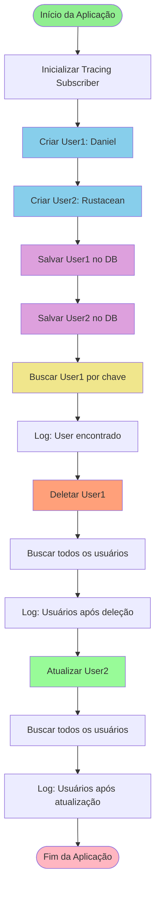
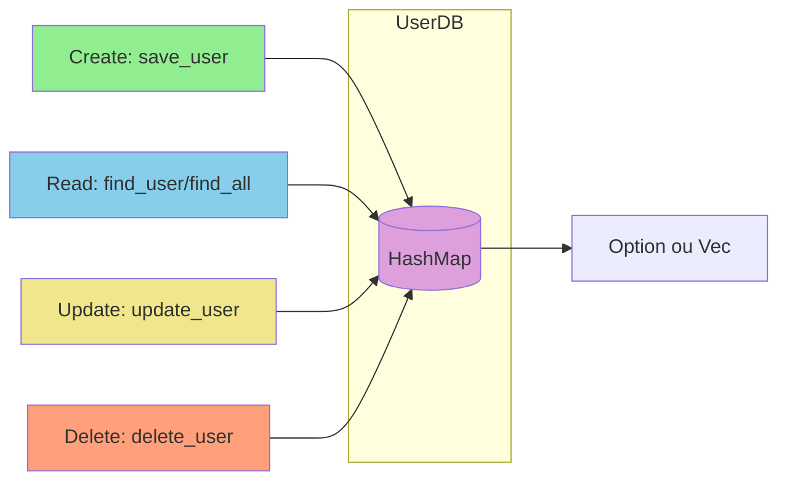

# Rust Learning - User Database Application

Projeto de aprendizado de Rust implementando um sistema de gerenciamento de usuários em memória com operações CRUD básicas.

## 📋 Descrição

Este projeto é uma aplicação simples desenvolvida em Rust para fins educacionais, demonstrando conceitos fundamentais da linguagem como:

- Estruturas de dados (structs)
- Traits e implementações
- Sistema de módulos
- Gerenciamento de memória
- Logging com tracing
- Collections (HashMap)

A aplicação implementa um banco de dados em memória para gerenciar usuários com operações básicas de Create, Read, Update e Delete (CRUD).

## 📊 Diagrama de Fluxo



### Fluxo de Operações CRUD



## 🚀 Funcionalidades

- **Criar usuários**: Criação de novos usuários com nome, email e idade
- **Buscar usuários**: Busca individual por chave ou listagem de todos os usuários
- **Atualizar usuários**: Atualização de dados de usuários existentes
- **Deletar usuários**: Remoção de usuários do banco de dados
- **Logging**: Sistema de logs detalhado usando tracing

## 🏗️ Estrutura do Projeto

```
src/
├── main.rs              # Ponto de entrada da aplicação
├── models/
│   └── user.rs          # Modelo de dados do usuário
├── service/
│   └── db_memory.rs     # Implementação do banco de dados em memória
└── utils/
    └── utils.rs         # Funções utilitárias (geração de números aleatórios)
```

## 🛠️ Tecnologias Utilizadas

- **Rust** (Edition 2024)
- **tracing** - Sistema de logging estruturado
- **tracing-subscriber** - Subscriber para outputs de logs
- **rand** - Geração de números aleatórios
- **Docker** - Containerização da aplicação

## 📦 Dependências

```toml
rand = "0.10.0-rc.8"
tracing = "0.1"
tracing-subscriber = "0.3"
log = "0.4.29"
```

## 🚀 Como Executar

### Localmente

1. Certifique-se de ter o Rust instalado (https://rustup.rs/)

2. Clone o repositório e navegue até o diretório:
```bash
cd app
```

3. Execute o projeto:
```bash
cargo run
```

4. Para compilar em modo release:
```bash
cargo build --release
```

### Com Docker

1. Build da imagem:
```bash
docker build -t rust-learning-app .
```

2. Execute o container:
```bash
docker run rust-learning-app
```

## 📝 Exemplo de Uso

A aplicação demonstra todas as operações CRUD no arquivo `main.rs`:

```rust
// Criação de usuários
let user1 = user_model::new(
    String::from("Daniel"),
    String::from("dds@test.com"),
    generate_random_number(),
);

// Salvando no banco
db.save_user("user1".to_string(), user1);

// Buscando usuário
let user = db.find_user("user1");

// Atualizando usuário
db.update_user("user1".to_string(), updated_user);

// Deletando usuário
db.delete_user("user1");

// Listando todos os usuários
let users = db.find_all();
```

## 🎯 Objetivos de Aprendizado

Este projeto foi criado para praticar:

- ✅ Ownership e borrowing em Rust
- ✅ Pattern matching e tratamento de Option<T>
- ✅ Organização de código em módulos
- ✅ Uso de HashMap e collections
- ✅ Mutabilidade explícita
- ✅ Sistema de logging
- ✅ Containerização com Docker

## 📄 Licença

Este é um projeto educacional para aprendizado de Rust.

## 👤 Autor

Daniel Dias
