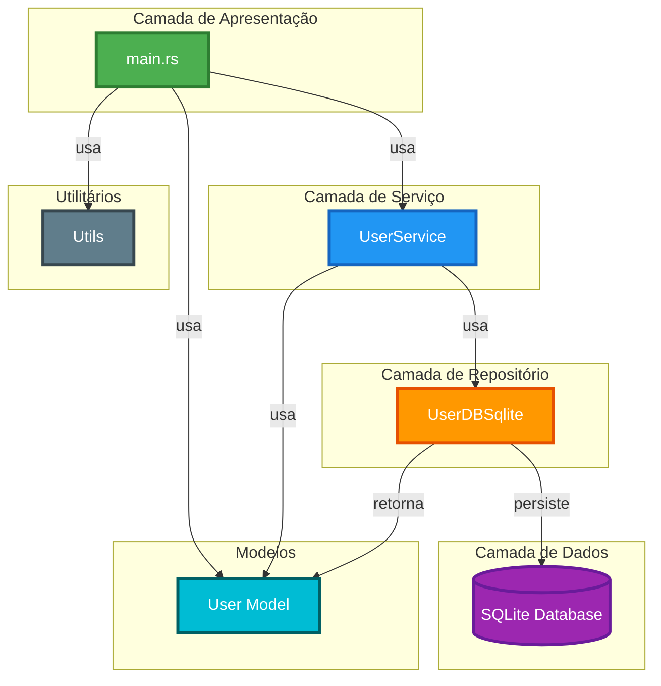
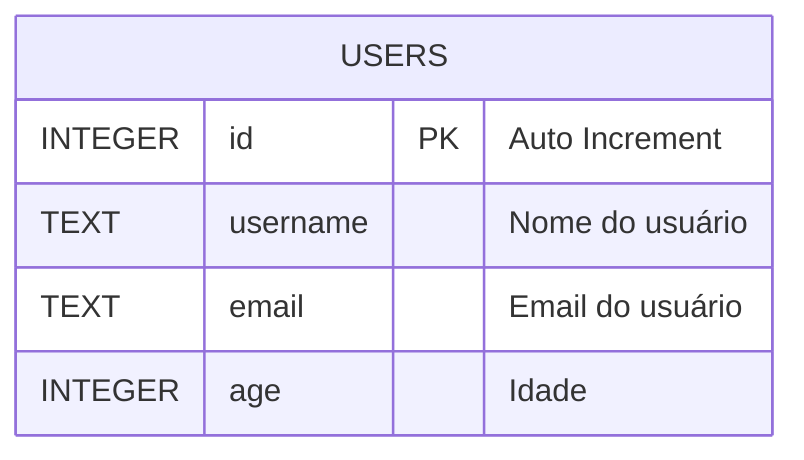
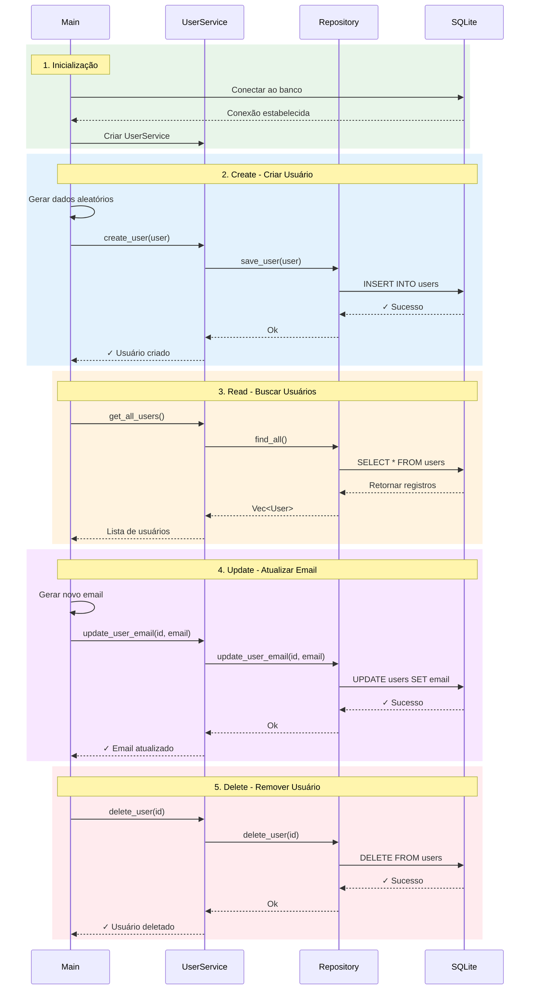

# Rust Learning - CRUD de Usuários

Projeto de aprendizado em Rust implementando um CRUD completo de usuários com SQLite.

## 📋 Descrição

Aplicação assíncrona em Rust que demonstra operações básicas de CRUD (Create, Read, Update, Delete) com banco de dados SQLite, utilizando SQLx para persistência de dados e Tokio como runtime assíncrono.

## 🚀 Tecnologias Utilizadas

- **Rust** (Edition 2024)
- **SQLx** - Driver assíncrono para SQLite
- **Tokio** - Runtime assíncrono
- **Tracing** - Sistema de logging estruturado
- **Anyhow** - Tratamento de erros simplificado
- **Rand** - Geração de dados aleatórios

## 🏗️ Arquitetura

O projeto segue uma arquitetura em camadas:



## 📦 Funcionalidades

A aplicação demonstra as seguintes operações:

- ✅ **Create**: Criação de usuários com dados aleatórios
- ✅ **Read**: Listagem de todos os usuários
- ✅ **Update**: Atualização de email do usuário
- ✅ **Delete**: Remoção de usuários

## 🛠️ Instalação e Execução

### Pré-requisitos

- Rust (versão 1.93 ou superior)
- Cargo

### Executar localmente

```bash
# Clonar o repositório
git clone <url-do-repositorio>

# Entrar no diretório
cd app

# Executar a aplicação
cargo run
```

### Executar com Docker

```bash
# Build da imagem
docker build -t rust-learning .

# Executar container
docker run rust-learning
```

## 📊 Estrutura do Banco de Dados



**Schema SQL:**
```sql
CREATE TABLE users (
    id INTEGER PRIMARY KEY AUTOINCREMENT,
    username TEXT NOT NULL,
    email TEXT NOT NULL,
    age INTEGER NOT NULL
);
```

## 📝 Fluxo de Execução

O programa executa automaticamente as seguintes operações:



## 🔍 Logs

A aplicação utiliza o sistema de tracing para logs estruturados, fornecendo informações detalhadas sobre:
- Inicialização da aplicação
- Operações de CRUD
- Erros e exceções

## 📄 Licença

Projeto de aprendizado - uso livre para fins educacionais.

